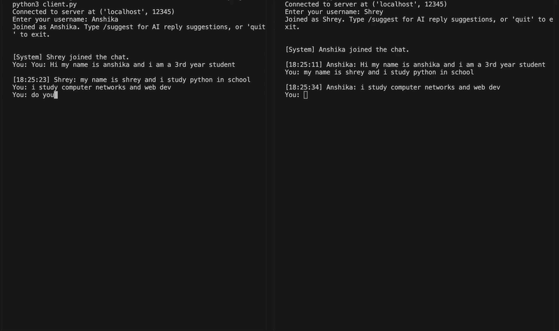

# concurrent-chat-ai



A multi-client TCP chat application in Python with two layers of AI integration — client-side reply suggestions and a server-side tool-calling AI agent.

Built to demonstrate concurrent programming, network sockets, thread synchronization, and applied AI/agent design.

---

## Features

- **Multi-client real-time chat** over raw TCP sockets — no external libraries for networking
- **Thread-safe broadcast server** — handles N concurrent clients with a shared state protected by locks
- **`/suggest`** — AI-generated reply suggestions based on recent conversation context (Groq API)
- **`@bot`** — a tool-calling AI agent that can check the time in any timezone, do calculations, and search the web, all from inside the chat

---

## Architecture

```
client.py  <---TCP--->  server.py  <---TCP--->  client.py
                            |
                            v
                         bot.py  --->  tools.py
                     (AI agent loop)   (get_time, calculate, search_web)
```

- **server.py** — accepts connections, broadcasts messages to all clients, detects `@bot` mentions and routes them to the agent
- **client.py** — sends/receives messages over two threads (input + receive), hosts the `/suggest` feature
- **bot.py** — the agent's reasoning loop: asks the LLM what to do, executes the chosen tool, asks the LLM again for a natural-language reply
- **tools.py** — pure functions the agent can call, plus a registry for easy extension

---

## CS concepts demonstrated

- **TCP socket programming** — `bind`, `listen`, `accept`, `connect`, `send`, `recv`
- **Multi-threading** — one thread per client on the server; separate input/receive threads on the client
- **Synchronization** — `threading.Lock()` protecting shared state (`clients_list`, `message_history`) to prevent race conditions
- **Producer-consumer pattern** — receive thread writes to a shared buffer, main thread reads from it
- **Distributed system design** — server as a central broker, AI logic kept client-side or server-side intentionally to keep concerns separated
- **AI agent / tool-calling architecture** — the LLM decides *what* to do, the code executes it, the LLM narrates the result

---

## Setup

```bash
# clone the repo
git clone https://github.com/Anshika-ag06/concurrent-chat-ai.git
cd concurrent-chat-ai

# create a virtual environment
python -m venv venv
source venv/bin/activate      # Windows: venv\Scripts\activate

# install dependencies
pip install -r requirements.txt

# set up your API key
cp .env.example .env
# open .env and add your GROQ_API_KEY (free at console.groq.com)
```

---

## Running

Open three terminals:

```bash
# Terminal 1 — start the server
python server.py

# Terminal 2 — first client
python client.py

# Terminal 3 — second client
python client.py
```

---

## Usage

| Command | What it does |
|---|---|
| Type any message | Broadcasts to all connected clients |
| `/suggest` | Get 3 AI-generated reply suggestions based on recent chat |
| `@bot <question>` | Ask the AI agent — it can check time, calculate, or search the web |
| `quit` | Disconnect from the chat |

**Example:**
```
You: @bot what time is it in Tokyo?
[Bot]: It's 11:45 PM in Tokyo right now!

You: @bot calculate 18% tip on 1200 rupees
[Bot]: An 18% tip on ₹1200 is ₹216, bringing your total to ₹1416.
```

---

## Tech stack

`Python` · `socket` · `threading` · `Groq API` (LLaMA 3.1) · `duckduckgo-search` · `pytz`

---

## Future improvements

- Replace `eval()`-based calculator with a proper math parser for added safety
- Add persistent chat history (SQLite)
- Move from one-thread-per-client to `asyncio` for better scalability
- Real-time message translation between users speaking different languages
